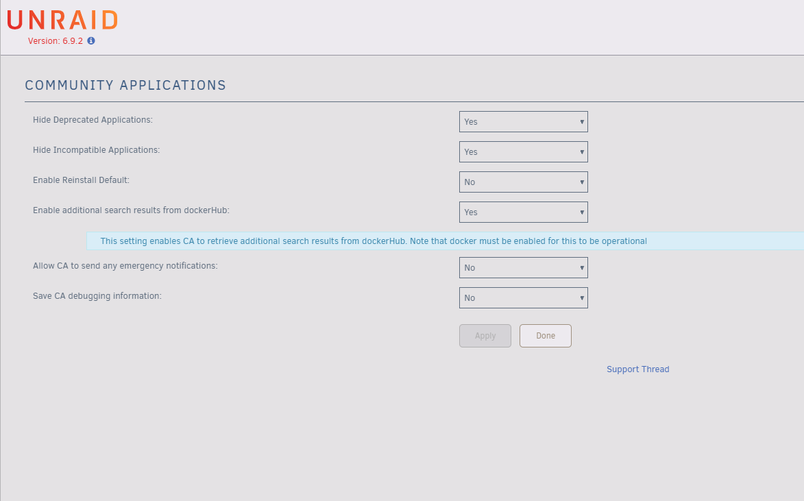

Created on 02-05-2021

Contributed by Jordy Coder.

##How to get started?

What do you need?

Go to your server adres:
1. 10.*.*.*.
2. Login unRAID
3. Go to APPS
3. Install 	Community Applications

